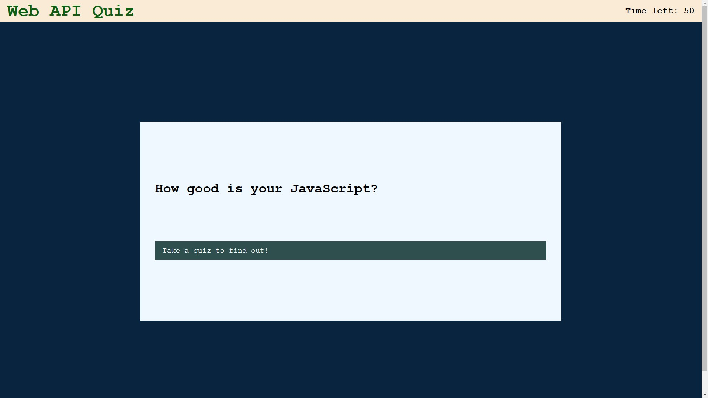

# Web API Quiz

## Description

This is a quiz that tests the user's knowledge on web APIs in JavaScript. It has multiple choice questions on topics such as data types, arrays, and debugging commands.

The bulk of this website was coded with JavaScript web APIs - including element attributes, appends, timers, and event listeners.

## Installation

N/A

## Usage

Open the website (<https://anj-23.github.io/web-api-quiz/>), press the "Take the quiz to find out!" button, and answer the multiple choice prompts as best and quickly as possible to achieve the highest score.

Once the quiz has finished, enter your username or initials into the input box, then press the "Submit" button. Your highest score should be displayed on the page.

The quiz can be taken again by pressing the "Take the quiz to find out!" button once more.

## Credits

Special thanks to the University of Minnesota - Twin Cities for jumpstarting my coding journey.

## License

MIT License

Copyright (c) [2023] [Andrew Joo]

Permission is hereby granted, free of charge, to any person obtaining a copy
of this software and associated documentation files (the "Software"), to deal
in the Software without restriction, including without limitation the rights
to use, copy, modify, merge, publish, distribute, sublicense, and/or sell
copies of the Software, and to permit persons to whom the Software is
furnished to do so, subject to the following conditions:

The above copyright notice and this permission notice shall be included in all
copies or substantial portions of the Software.

THE SOFTWARE IS PROVIDED "AS IS", WITHOUT WARRANTY OF ANY KIND, EXPRESS OR
IMPLIED, INCLUDING BUT NOT LIMITED TO THE WARRANTIES OF MERCHANTABILITY,
FITNESS FOR A PARTICULAR PURPOSE AND NONINFRINGEMENT. IN NO EVENT SHALL THE
AUTHORS OR COPYRIGHT HOLDERS BE LIABLE FOR ANY CLAIM, DAMAGES OR OTHER
LIABILITY, WHETHER IN AN ACTION OF CONTRACT, TORT OR OTHERWISE, ARISING FROM,
OUT OF OR IN CONNECTION WITH THE SOFTWARE OR THE USE OR OTHER DEALINGS IN THE
SOFTWARE.
